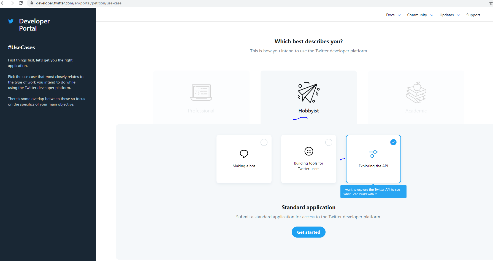

# Iowa Code Camp Social Media System API #

*iowacodecamp-socialmedia-sapi* is a system layer API used to support interfaces with Twitter/Potentially other social media API services needed for the Iowa Code Camp website (http://iowacodecamp.com/) database written with Mulesoft 4.

This application is setup with a basic set of initial services intended facilitate a realistic example of exercises we perform as developers at UFG (web development) and will be used for new hire and candidate interviews. It is based on the following problem posed to previous candidates to better understand their ability to be successful as a developer at UFG.

[The Code Camp Problem](README/TheCodeCampProblem.pdf)

## Getting Started ##

### Developer Tools ###

- If you don't already have your own personal Mulesoft developer account, sign up for one here: https://anypoint.mulesoft.com/login/. Open the support site here: https://help.mulesoft.com/user/profile, the enter here to download the latest Anypoint Studio IDE: https://help.mulesoft.com/s/downloads.

- Install maven https://maven.apache.org/download.cgi

- Install free JDK https://adoptopenjdk.net/

- Install Postman https://www.postman.com/downloads/

### Twitter Developer API Setup ###

- Sign up for a Twitter Developer API account here and apply for the standard product, then choose the Explore API option:
https://developer.twitter.com/en/docs/twitter-api/getting-started/getting-access-to-the-twitter-api

- You will be given early access and immediate authorization tokens to the endpoints we will use regardless of the sign up review Twitter performs after you answer their questions on how you will use their API.

- Twitter API reference [here](https://developer.twitter.com/en/docs/twitter-api/tweets/timelines/introduction) (along with Postman example collection for Twitter API at the bottom), utilize the referenced Postman examples Twitter provides for your own exploration of their API once you have obtained your Bearer token from your sign up above, then change the workspace Authorization tab in Postman for the Twitter API collection to Bearer and paste your bearer token value in there.

### Anypoint Platform ###
- If you need to make specification changes, create a Design Center instance from your signed up Anypoint Platform account of iowacodecamp-socialmedia-sapi and copy the repo /src/main/resources/api folder and import it into your instance.

### Anypoint Studio Launch Configuration ###
- Ensure you add VM argument -M-Danypoint.platform.gatekeeper=disabled to the run/debug launch configuration. See launchconfig repo folder for an example launch configuration you can import and use in Anypoint Studio.
- Ensure you add/change VM argument -M-Dtwitter.bearer.token=REPLACEME with your Twitter API provisioned bearer token.

### Postman Examples ###
- Example services collection is provided in the postman repo folder

## The IowaCodeCamp.com Project Exercise ##
TODO list out background, expectations, reference the other project repositories, UI, etc

Potential Exercises:

build out speaker page/display section

build out schedule section

build out register for an event/conference

health check - provide request to set this up

client id/secret setup in API manager

traits

fix tests

refactor RAML - data types

reactor implementation

metadata

add session/speaker location data for UI map display

fix session missing properties

database schema cleanup
